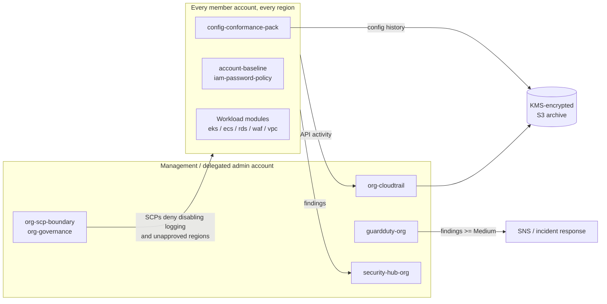

# FedRAMP Terraform Library

[](https://github.com/DustyStudy/fedramp-terraform-library/actions/workflows/ci.yml)
[](./LICENSE)

Reusable Terraform modules that implement common controls and security
patterns for organizations pursuing **FedRAMP Moderate**, **FedRAMP
High**, or **FedRAMP 20x** authorization.

**At a glance**

- **Problem:** FedRAMP control implementations get rebuilt by hand for every
  system, and a plan that passes `terraform validate` can still grant too much.
- **Approach:** 16 hardened modules composed into Moderate, High and 20x
  (10 KSI clusters) tracks, with FIPS endpoints and partition-aware ARNs for
  GovCloud.
- **Verification:** 32 `terraform test` runs assert the rendered IAM and
  bucket policies at plan time. Checkov, Trivy and Gitleaks run on every PR.

## ⚠️ Disclaimer

These modules support the *implementation* of security controls. They do
**not**, by themselves, constitute a FedRAMP authorization. An Authority to
Operate (ATO) requires an agency sponsor, a 3PAO (Third Party Assessment
Organization) assessment, and an approved System Security Plan (SSP). Treat
this repo as a starting point for your control implementation evidence, not
a substitute for the assessment process.

Modules are provided as-is with no warranty. Review every variable,
resource, and IAM policy before applying to any environment, and validate
against your organization's current SSP and your 3PAO's expectations.

## Why three separate tracks?

- **`moderate/`** and **`high/`** map to the NIST SP 800-53 Rev5 control
  baselines. High reuses Moderate's modules with tighter values rather
  than duplicating module code: longer log and backup retention, a
  dedicated EBS CMK, and a 16-character password minimum. Both tracks
  send AWS API calls to FIPS endpoints (see [FIPS endpoints](#fips-endpoints)).
- **`fedramp-20x/`** is *not* a control baseline. FedRAMP 20x
  certifications are validated against machine-readable **Key Security
  Indicators (KSIs)**: a fundamentally different assessment model.
  FedRAMP's "Consolidated Rules for 2026" moved 20x from pilot to a
  generally available certification path (effective 2026-06-24) and
  finalized 10 KSI clusters. See `fedramp-20x/README.md` for the current
  cluster list and a cross-reference of which existing modules already
  satisfy each one, and `docs/FEDRAMP-20X-CHEAT-SHEET.md` for the 2026
  terminology/timeline changes (Authorization → Certification, Class
  B/C/D).

## How the pieces fit



## Structure

```
modules/              Shared baseline modules used across all three tracks
moderate/             Rev5 Moderate baseline, by control family
high/                 Rev5 High: reuses moderate/ with tfvars overrides
fedramp-20x/          KSI-based cross-reference (CNA, IAM, MLA, SVC, INR, CMT, RPL, PIY, SCR, CED)
docs/                 Control-to-module cross-reference
```

## Modules

| Module | What it does |
|---|---|
| `org-cloudtrail` | Organization-wide CloudTrail, KMS-encrypted, with a dedicated access-log bucket |
| `config-conformance-pack` | AWS Config recorder + encrypted delivery channel, optional FedRAMP Moderate conformance pack |
| `guardduty-org` | GuardDuty with organization auto-enrollment, findings routed to SNS |
| `security-hub-org` | Security Hub with default standards + organization auto-enrollment |
| `iam-password-policy` | Account-wide IAM password policy |
| `account-baseline` | EBS default encryption, S3 account public access block, optional default-VPC/SG lockdown |
| `ecr-hardened` | KMS-encrypted ECR repository, tag immutability, scan-on-push |
| `ecs-fargate-hardened` | ECS cluster with Container Insights and KMS-encrypted logging (incl. ECS Exec) |
| `eks-hardened` | EKS cluster with KMS secrets envelope encryption, full control-plane logging, private-only endpoint |
| `fips-vpc-endpoints` | VPC interface endpoints: see the module's `variables.tf` for which services genuinely have FIPS-suffixed endpoints and which don't |
| `network-perimeter-vpc` | 3-tier VPC with KMS-encrypted Flow Logs and a locked-down default security group |
| `org-governance` | Workload-perimeter SCP, AI-services opt-out policy, centralized backup policy |
| `org-scp-boundary` | Region-lock SCP, security-service protection, insecure-transport deny |
| `rds-postgres-hardened` | Multi-AZ PostgreSQL with enforced TLS, KMS encryption, managed master password |
| `ssm-patching-hardened` | Automated patch baseline, weekly maintenance window, KMS-encrypted patch logs |
| `waf-hardened` | Regional WAFv2 with AWS-managed rule groups, rate limiting, KMS-encrypted logging |
| `moderate/iam-access-control` | Access Analyzer, permission boundary, enforced-MFA group, root usage alerting |
| `moderate/logging-monitoring` | 14 CIS/Security Hub CloudWatch metric-filter + alarm pairs |
| `moderate/network-boundary/vpc-flow-logs` | VPC Flow Logs to encrypted S3, for an existing VPC |
| `moderate/network-boundary/default-security-group-lockdown` | Strips all rules from an existing VPC's default security group (native resource; no custom scripting needed, unlike CFN) |
| `moderate/data-protection/kms-cmk-baseline` | Reusable customer-managed KMS key for encryption at rest |
| `moderate/incident-response/incident-notifications` | Aggregated SNS topic for high-severity GuardDuty/Security Hub findings |

See `docs/control-mapping.md` for the NIST 800-53/20x KSI mapping per
module, and `docs/NIST-800-53-REV5-MATRIX.md` for the same information
organized by control ID instead.

## Examples

Every module above is documented in isolation. **`examples/`** shows a
realistic set of them composed into an actual management-account and
member-account baseline, including two duplicate-resource conflicts
that only showed up once modules were wired together, and how to avoid
them.

## Compliance documentation beyond control mapping

Passing a FedRAMP audit takes more than deployed infrastructure. These
docs are aimed at that gap directly:

- **`docs/CUSTOMER-RESPONSIBILITY-MATRIX.md`**: what AWS already covers,
  what this repo automates, what's still a manual process
- **`docs/COVERAGE-GAPS.md`**: control families and requirements this
  repo genuinely cannot address (personnel security, training, the SSP
  itself, tested IR/contingency plans, and more), stated plainly rather
  than left implicit
- **`docs/CONTINUOUS-MONITORING.md`**: how this repo's modules feed
  FedRAMP's CR26 continuous monitoring (quarterly CCM reports, VDR
  timeframes, SCN), and what it requires that nothing here automates
- **`docs/POAM-TEMPLATE.md`**: legacy Rev5 finding tracker; under CR26,
  providers report vulnerabilities under VDR/VER instead
- **`CHANGELOG.md`**: change history, in the spirit of the documentation
  discipline FedRAMP's Significant Change Notification (SCN) rules expect

## FIPS endpoints

Every root configuration in this repo (`moderate/`, `high/`, `examples/`) sets
`use_fips_endpoint = var.use_fips_endpoint` on the AWS provider, defaulting to
`true`, so all Terraform API calls go to FIPS 140 validated endpoints. Under
FedRAMP's `CMU-CSO-UVM`, validated crypto is a MUST for Class D and a SHOULD for
Class C.

- **Calling the modules from your own root?** Modules don't configure
  providers, so set `use_fips_endpoint = true` in your own `provider "aws"`
  block (or export `AWS_USE_FIPS_ENDPOINT=true`).
- **Coverage checked:** every service these modules call resolves to a FIPS
  endpoint in us-east-1, us-west-2, us-gov-west-1 and us-gov-east-1. This was
  checked against the AWS SDK's endpoint rules and DNS, including S3 and S3
  Control. In GovCloud, the FIPS endpoints for many services are the standard
  regional hostnames ([AWS FIPS endpoints](https://aws.amazon.com/compliance/fips/)).
- **S3 bucket names must not contain dots.** S3 FIPS endpoints are
  virtual-hosted only. `trail_name` and `config_bucket_name` validate this.
- FIPS endpoints protect the API channel. Data-plane TLS (load balancers,
  databases, your application) is configured separately; see
  `modules/fips-vpc-endpoints` and `docs/COVERAGE-GAPS.md`.

## A Terraform-specific note

Unlike CloudFormation, the Terraform AWS provider has native resources for
a couple of things that required Lambda-backed custom resources in the CFN
version of this library: `aws_iam_account_password_policy` and
`aws_guardduty_organization_configuration` both exist for real. Where
that's true, the module here is simpler and more idiomatic than its CFN
counterpart; where Terraform has the same kind of gap CloudFormation did,
the module says so directly in its README.

## Tests

The core modules under `modules/` have `terraform test` suites in their
`tests/` directory. They cover `org-cloudtrail`, `config-conformance-pack`,
`guardduty-org`, `security-hub-org`, `iam-password-policy`,
`account-baseline` and `org-scp-boundary`. Each test runs `plan` against the
real AWS provider with dummy credentials, so it needs no AWS account. It
asserts the security properties the control mapping claims, for example:

- the organization trail is multi-region with log file validation on
- every CloudTrail grant on the log bucket is pinned to the trail's ARN
- the SCP denies stopping CloudTrail, Config, GuardDuty and Security Hub
- ARNs use the GovCloud partition when deployed there
- invalid inputs (dotted bucket names, malformed org IDs) are rejected

```sh
cd modules/org-cloudtrail
terraform init -backend=false
terraform test
```

## Security scanning

Every push and PR to `main` runs automatically via GitHub Actions
(`.github/workflows/ci.yml`), in four jobs:

- **Gitleaks**: secret/credential scanning
- **`terraform fmt` + tflint**: formatting and Terraform best practices
- **`terraform test`**: plan-only tests for the core modules (see
  [Tests](#tests))
- **Checkov** (blocking) and **Trivy** (reporting to the Security tab):
  two independent security/compliance scanners against the templates
  themselves

Check the **Actions** tab on GitHub after your first push; new modules
sometimes get flagged for things that are intentional design choices in a
security baseline (for example, the permission boundary's broad `NotAction`
grant is deliberate, not an oversight). Where a finding is an accepted
risk rather than a bug, add a `#checkov:skip=CKV_AWS_XXX:<reason>` comment
directly above the resource so the justification travels with the code;
see `CONTRIBUTING.md` for the pattern.

## Getting started

1. Start with `modules/`: these are the foundational building blocks
   (organization CloudTrail, AWS Config, GuardDuty, Security Hub, IAM
   password policy) that nearly every control family in Moderate, High, and
   every KSI category in 20x depends on. Each module is self-contained
   with its own `variables.tf`, `main.tf`, `outputs.tf`, and `README.md`.
2. Reference the modules you need from your own root Terraform
   configuration:
   ```hcl
   module "org_cloudtrail" {
     source          = "github.com/DustyStudy/fedramp-terraform-library//modules/org-cloudtrail"
     organization_id = "o-xxxxxxxxxx"
   }
   ```
3. Check `docs/control-mapping.md` to see which NIST 800-53 control IDs (or
   KSI IDs) each module addresses, and use it to build your control
   implementation evidence for your SSP.

## Contributing

See `CONTRIBUTING.md`. PRs that add control mapping documentation alongside
new modules are especially welcome.

## Reporting a security issue

See `SECURITY.md`; please don't open a public issue for a security
finding.

## License

Apache License 2.0, see `LICENSE`.
